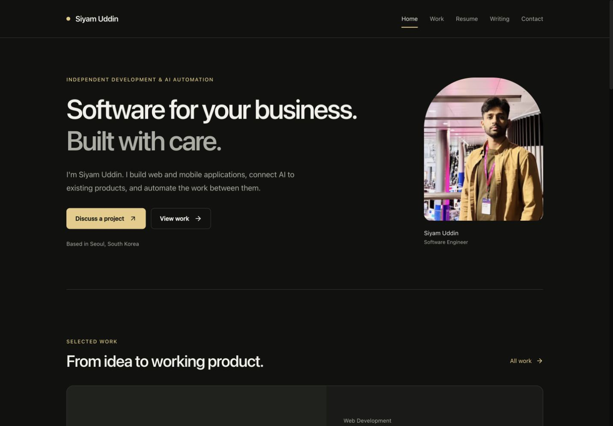
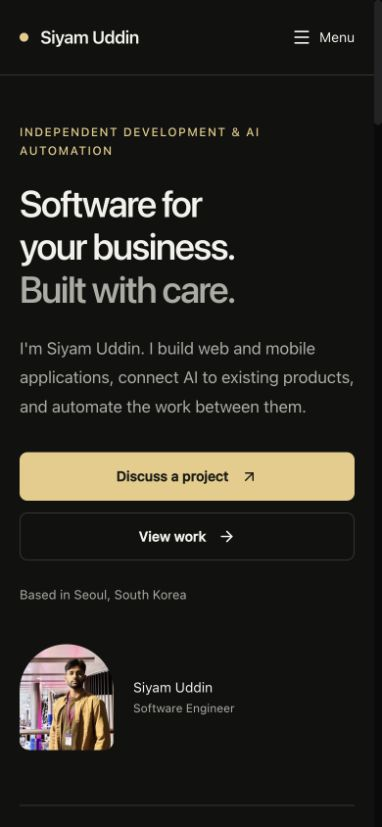

# Portfolio redesign review

## Result

Implemented on `codex/portfolio-design-seo`, based on remote `main` at `563a690`, with the existing schema-refresh fix incorporated as `22733f7`. The original three icon deletions are preserved. This document records verification before the production release.

The public site now has an open dark layout, system typography, a responsive header, project-specific actions, a clearer service hierarchy, native FAQ disclosures, and a visible email alternative to the contact form. Public 3D effects were removed; the separate admin finance visuals remain. Public styles are scoped, and the admin keeps its existing font.

CMS data remains authoritative. Local fallback descriptions were simplified, outdated graduation language removed, and nonexistent sample images replaced by a local neutral fallback. No production CMS content or schema was changed.

## Verification

- `npm run lint`: passed with no warnings.
- `npx tsc --noEmit`: passed.
- `npm test`: 15 tests passed using Node's test runner and the existing TypeScript compiler. No new runtime or test dependencies were added.
- `npm run build`: passed, including Next.js type and lint checks.
- `git diff --check`: passed.
- Home, work, resume, writing, article, and contact pages checked at 390, 768, and 1440px viewport widths: no horizontal overflow, one main heading, sequential section headings, and no public canvases.
- Contact checked at 320px: visible controls meet the 44px height target; fields and primary button also exceed 44px in width.
- Mobile menu open/close, Escape, navigation, active Writing state on articles, keyboard skip-to-content, native FAQ expansion, and project filtering verified in the browser.
- Contact UI verified with local simulated responses: invalid input, disabled sending state, delivery failure, retry, success, cleared success fields, interrupted connection, and retained failed input. The unconfigured real local endpoint correctly returns 503. No real messages were sent.
- Public titles/canonicals, valid JSON-LD serialization, sitemap, robots, icons, manifest, resume PDF, and generated social image verified. The www URL redirects with 308 and preserves the path. Missing articles return 404; admin login remains noindex.
- Regression tests cover unpublished CMS article fallback, exclusion of drafts/empty articles from the sitemap, independent website/source links, input length limits, rate limiting, delivery results, invalid dates, and script-safe structured data.
- Text contrast: primary 16.60:1; secondary on cards 7.53:1; primary button text 10.83:1. Input boundaries: 3.67:1.

## Performance comparison

Same machine, production builds, repository fallback content. Next.js reported first-load JavaScript:

| Page | Before | After |
| --- | ---: | ---: |
| Home | 391 kB | 130 kB |
| Work | 145 kB | 131 kB |
| Writing | 142 kB | 130 kB |
| Contact | 222 kB | 204 kB |

The homepage reduction is about 67%. These are build-reported sizes, not Lighthouse scores or real-user Core Web Vitals. LCP, INP, and CLS were not measured. Public routes no longer load the decorative Three.js scene or Google font.

## Review limits and deployment checks

- Local screenshots show fallback content because this preview is not connected to the production CMS. Some project/article images are absent from the repository, so screenshots demonstrate the fallback rather than production imagery. The image component also handles runtime image failures.
- Reflow at half desktop width (720px) passed. Native browser 200% zoom, VoiceOver, and OS-level reduced-motion emulation were not available through the browser connection. The scoped reduced-motion rule was inspected, and all public decorative animations were removed.
- Production storage/email credentials and inbox delivery were not exercised. Delivery behavior was tested with mocked storage and email responses. When the CMS is configured, an unavailable/unpublished article now fails closed instead of resurrecting static sample content.
- The existing dependency installation reported 6 vulnerabilities (5 high, 1 critical) before implementation. Dependency versions and the lockfile were not changed by this redesign; dependency upgrades need a separate review.
- Search Console indexing and field Core Web Vitals require post-release monitoring; neither was measured in this review. No search submission was performed.

## Screenshots and evidence

Screenshots are in `artifacts/portfolio-review/`: desktop home, work, resume, writing, article and contact; mobile home/contact; tablet home. The same folder includes build comparisons and structured browser/SEO check results.

